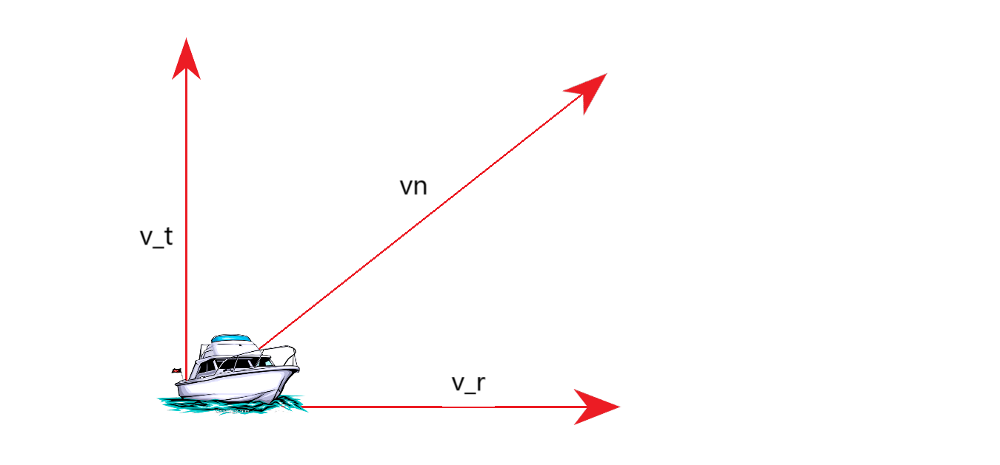

---
## Front matter
title: "Отчёт по лабораторной работе №2"
author: "Евгения Владимировна Великоднева"

## Generic otions
lang: ru-RU
toc-title: "Содержание"

## Bibliography
bibliography: bib/cite.bib
csl: pandoc/csl/gost-r-7-0-5-2008-numeric.csl

## Pdf output format
toc: true # Table of contents
toc-depth: 2
lof: true # List of figures
lot: true # List of tables
fontsize: 12pt
linestretch: 1.5
papersize: a4
# documentclass: scrreprt
## I18n polyglossia
polyglossia-lang:
  name: russian
  options:
	- spelling=modern
	- babelshorthands=true
polyglossia-otherlangs:
  name: english
## I18n babel
babel-lang: russian
babel-otherlangs: english
## Fonts
mainfont: PT Serif
romanfont: PT Serif
sansfont: PT Sans
monofont: PT Mono
mainfontoptions: Ligatures=TeX
romanfontoptions: Ligatures=TeX
sansfontoptions: Ligatures=TeX,Scale=MatchLowercase
monofontoptions: Scale=MatchLowercase,Scale=0.9
## Biblatex
biblatex: true
biblio-style: "gost-numeric"
biblatexoptions:
  - parentracker=true
  - backend=biber
  - hyperref=auto
  - language=auto
  - autolang=other*
  - citestyle=gost-numeric
## Pandoc-crossref LaTeX customization
figureTitle: "Рис."
tableTitle: "Таблица"
listingTitle: "Листинг"
lofTitle: "Список иллюстраций"
lotTitle: "Список таблиц"
lolTitle: "Листинги"
## Misc options
indent: true
header-includes:
  - \PassOptionsToPackage{russian, english}{babel}
  - \usepackage{indentfirst}
  - \usepackage{float} # keep figures where there are in the text
  - \floatplacement{figure}{H} # keep figures where there are in the text
  - \usepackage[utf8]{inputenx}
  - \input{ix-utf8enc.dfu}
  - \usepackage{mathtools}
  - \everymath{\displaystyle}
  # - \usepackage[russian]{babel}
---

# Цель работы

Цель данной работы - построение математических моделей для
выбора правильной стратегии при решении задачи преследования.

# Задание

1. Записать уравнение, описывающее движение катера, с начальными условиями для двух случаев (в зависимости от расположения катера относительно лодки в начальный момент времени).
2. Построить траекторию движения катера и лодки для двух случаев.
3. Найти точку пересечения траектории катера и лодки.

# Теоретическое введение

## Задача
На море в тумане катер береговой охраны преследует лодку браконьеров. Через определенный промежуток времени туман рассеивается, и лодка обнаруживается на расстоянии k км от катера. Затем лодка снова скрывается в тумане и уходит прямолинейно в неизвестном направлении. Известно, что скорость катера в n раза больше скорости браконьерской лодки.

## Значения переменных

$\displaystyle t_{0}$ = 0 - момент обнаружения лодки браконьеров.

$\displaystyle x_{л0}$ = 0 - место нахождения лодки браконьеров в момент обнаружения.

$\displaystyle x_{к0}$ = k - место нахождения катера береговой охраны относительно лодки браконьеров в момент обнаружения лодки.

$\displaystyle \theta = x_{л0} = 0$ - полюс, точка обнаружения лодки браконьеров.

r - полярная ось, проходит через точку нахождения катера береговой охраны.

x - расстояние после которого катер начнет двигаться вокруг полюса.

n - во сколько раз скорость катера больше скорости лодки.

$\displaystyle \upsilon$ - скорость лодки.

$\displaystyle \upsilon_{r}$ - радиальная скорость(скорость, с которой катер удаляется от полюса).

$\displaystyle \upsilon_{tau}$ - тангенциальная скорость(линейная скорость вращения катера относительно полюса).

# Выполнение лабораторной работы

1. Чтобы найти расстояние x составляем простое уравнение. Пусть через время t катер и лодка окажутся на одном расстоянии x от полюса. За это время лодка пройдет x, а катер
k - x(или
k + x, в зависимости от
начального положения катера относительно полюса). Время, за которое они пройдут это расстояние, вычисляется как $\displaystyle \frac{x}{\upsilon}$ и $\displaystyle \frac{k - x}{n\upsilon}$  или $\displaystyle \frac{k - x}{n\upsilon}$. Так как время одно и то же, то эти величины одинаковы. Тогда неизвестное расстояние x можно найти из следующих уравнений:
1. Для первого случая: $\displaystyle \frac{x}{\upsilon} = \frac{k - x}{n\upsilon}$
2. Для второго случая: $\displaystyle \frac{x}{\upsilon} = \frac{k + x}{n\upsilon}$
Сократим уравнения:
1. $\displaystyle x = \frac{k}{n} - \frac{x}{n}$
$\displaystyle ax + x = k$
$\displaystyle x = \frac{k}{a + 1}$

2. $\displaystyle x = \frac{k}{n} + \frac{x}{n}$
$\displaystyle ax - x = k$
$\displaystyle x = \frac{k}{a - 1}$

Подставив нужные значения, получаем:
$\displaystyle x_1 = 18/5.9, x_2 = 18/3.9$

Нарисуем график движения катера, чтобы разложить его скорость на тангенциальную и радиальную(рис. [-@fig:001]).

Описываются проведённые действия, в качестве иллюстрации даётся ссылка на иллюстрацию (рис. [-@fig:001]).

{#fig:001 width=70%}

Из рисунка видно, что $\displaystyle \upsilon_{tau} = \sqrt{n^2\upsilon^2 + \upsilon_{r}^2}$. Тогда получаем:
$\displaystyle r\frac{d\theta}{dt} = \sqrt{3.9}\upsilon $
$\displaystyle\[
  \begin{cases}
    \frac{dr}{dt} = \upsilon
    r\frac{d\theta}{dt} = \sqrt{3.9}\upsilon
  \end{cases}
\]$
С начальными условиями:
$\displaystyle\[
  \begin{cases}
  \theta_{0} = 0
  r_{0} = x_{1}
  \end{cases}
\]$
Или:
$\displaystyle\[
  \begin{cases}
  \theta_{0} = -\pi
  r_{0} = x_{2}
  \end{cases}
\]$

Исключая из полученной системы производную по t, можно перейти к следующему уравнению:
$\displaystyle \frac{dr}{d\theta} = \frac{r}{sqrt{3.9}} $

В scilab построила графики для обоих случаев:

{#fig:002 width=70%}

{#fig:003 width=70%}

# Выводы

Построили две математических модели длявыбора правильной стратегии при решении задачи преследования.