---
## Front matter
lang: ru-RU
title: Лабораторная работа №7
author:
  - Великоднева Е.В.
institute:
  - Российский университет дружбы народов, Москва, Россия
date: 23 марта 2024

## i18n babel
babel-lang: russian
babel-otherlangs: english

## Formatting pdf
toc: false
toc-title: Содержание
slide_level: 2
aspectratio: 169
section-titles: true
theme: metropolis
header-includes:
 - \metroset{progressbar=frametitle,sectionpage=progressbar,numbering=fraction}
 - '\makeatletter'
 - '\beamer@ignorenonframefalse'
 - '\makeatother'
---

# Вводная часть

## Цели

Цель работы - рассмотреть модель рекламной кампании и решить задачу по этой теме.

## Задача

Постройте график распространения рекламы, математическая модель которой описывается
следующим уравнением:
1. $\displaystyle \frac{dn}{dt} = (0.94+0.000094n(t))(N-n(t))$
2. $\displaystyle \frac{dn}{dt} = (0.000094+0.94n(t))(N-n(t))$
3. $\displaystyle \frac{dn}{dt} = (0.94sin(t)+0.94sin(t)n(t))(N-n(t))$
При этом объем аудитории $\displaystyle N = 1040$ в начальный момент о товаре знает 9 человек. Для случая 2 определите в какой момент времени скорость распространения рекламы будет иметь максимальное значение.

# Выполнение лабораторной работы

## Код на julia

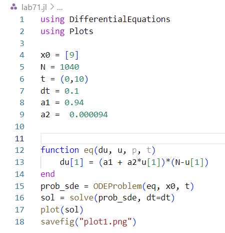{#fig:001 width=70%}

## Код на julia

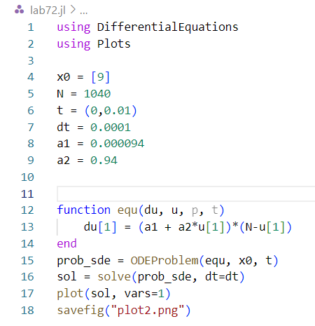{#fig:002 width=30%}

## Код на julia

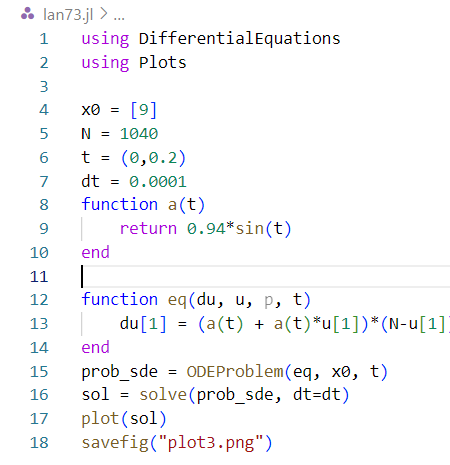{#fig:003 width=30%}

## Код в OpenModelica

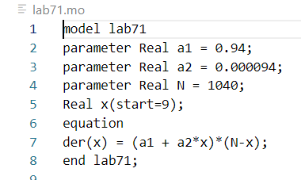{#fig:004 width=70%}

## Код в OpenModelica

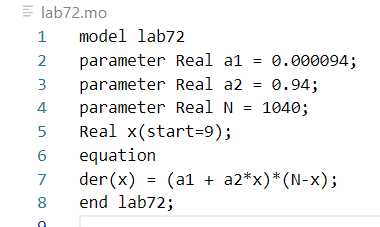{#fig:005 width=70%}

## Код в OpenModelica

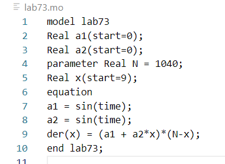{#fig:006 width=70%}

## Код в OpenModelica

{#fig:007 width=70%}

## Графики для первого пункта

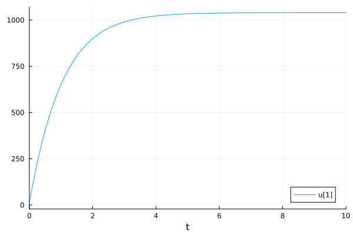{#fig:008 width=30%}

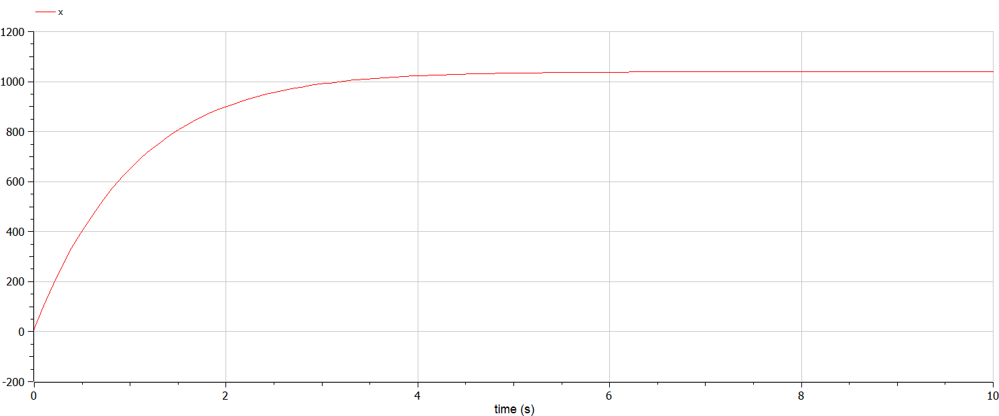{#fig:009 width=30%}

## Графики для второго пункта

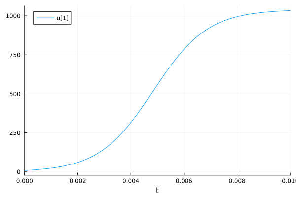{#fig:010 width=70%}

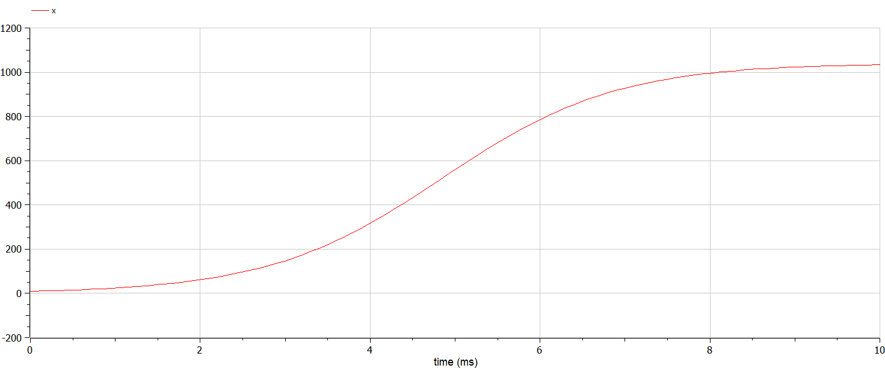{#fig:011 width=70%}

## Нахождение момента, в который скорость распространения рекламы имеет максимальное значение

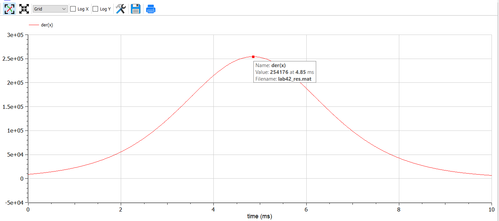{#fig:012 width=70%}

## Графики для третьего пункта

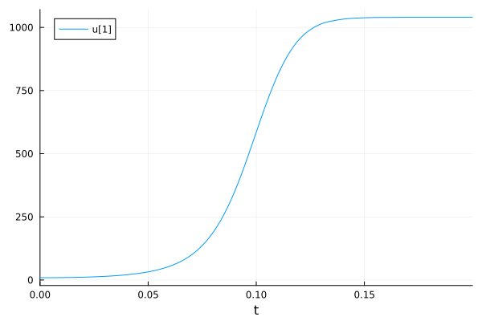{#fig:013 width=70%}

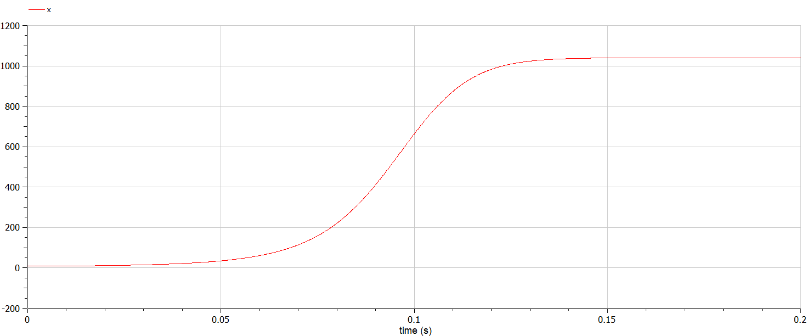{#fig:014 width=70%}

# Выводы

## Выводы

Рассмотрела модель рекламной кампании, построила графики в julia и OpenModelica для всех трёх случаев из задачи. Нашла, в какой момент времени скорость распространения рекламы имеет максимальное значение по графику в OpenModelica.