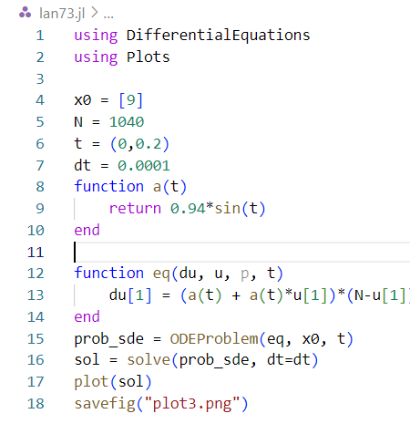
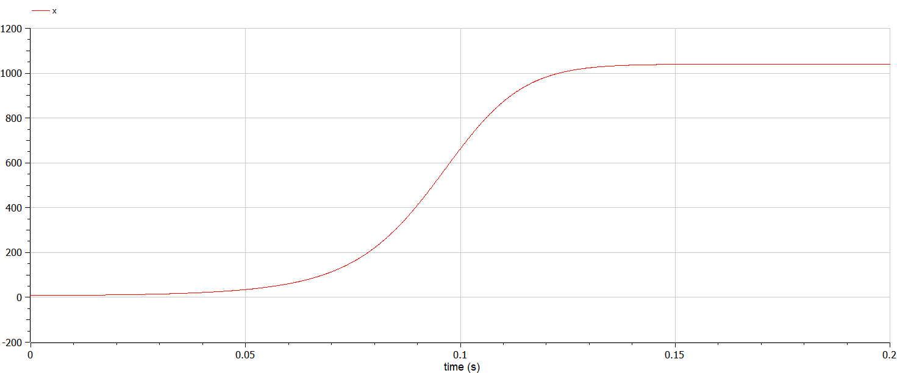

---
## Front matter
title: "Отчёт по лабораторной работе №7"
author: "Великоднева Евгения Владимировна"

## Generic otions
lang: ru-RU
toc-title: "Содержание"

## Bibliography
bibliography: bib/cite.bib
csl: pandoc/csl/gost-r-7-0-5-2008-numeric.csl

## Pdf output format
toc: true # Table of contents
toc-depth: 2
lof: true # List of figures
lot: true # List of tables
fontsize: 12pt
linestretch: 1.5
papersize: a4
documentclass: scrreprt
## I18n polyglossia
polyglossia-lang:
  name: russian
  options:
	- spelling=modern
	- babelshorthands=true
polyglossia-otherlangs:
  name: english
## I18n babel
babel-lang: russian
babel-otherlangs: english
## Fonts
mainfont: PT Serif
romanfont: PT Serif
sansfont: PT Sans
monofont: PT Mono
mainfontoptions: Ligatures=TeX
romanfontoptions: Ligatures=TeX
sansfontoptions: Ligatures=TeX,Scale=MatchLowercase
monofontoptions: Scale=MatchLowercase,Scale=0.9
## Biblatex
biblatex: true
biblio-style: "gost-numeric"
biblatexoptions:
  - parentracker=true
  - backend=biber
  - hyperref=auto
  - language=auto
  - autolang=other*
  - citestyle=gost-numeric
## Pandoc-crossref LaTeX customization
figureTitle: "Рис."
tableTitle: "Таблица"
listingTitle: "Листинг"
lofTitle: "Список иллюстраций"
lotTitle: "Список таблиц"
lolTitle: "Листинги"
## Misc options
indent: true
header-includes:
  - \usepackage{indentfirst}
  - \usepackage{float} # keep figures where there are in the text
  - \floatplacement{figure}{H} # keep figures where there are in the text
---

# Цель работы

Цель работы - рассмотреть модель рекламной кампании и решить задачу по этой теме.

# Задание

Постройте график распространения рекламы, математическая модель которой описывается
следующим уравнением:
1. $\displaystyle \frac{dn}{dt} = (0.94+0.000094n(t))(N-n(t))$
2. $\displaystyle \frac{dn}{dt} = (0.000094+0.94n(t))(N-n(t))$
3. $\displaystyle \frac{dn}{dt} = (0.94sin(t)+0.94sin(t)n(t))(N-n(t))$
При этом объем аудитории $\displaystyle N = 1040$ в начальный момент о товаре знает 9 человек. Для случая 2 определите в какой момент времени скорость распространения рекламы будет иметь максимальное значение.

# Теоретическое введение

Модель рекламной кампании описывается величинами, значения которых приведены в табл. [-@tbl:std-dir] 
: Значения переменных {#tbl:std-dir}

| Переменная                              | Значение переменной                                                                             |
|-----------------------------------------|-------------------------------------------------------------------------------------------------|
| $\displaystyle \frac{dn}{dt}$           | скорость изменения со временем числа потребителей, узнавших о товаре и готовых его купить       |
| $\displaystyle t$                       | Время, прошедшее с начала рекламной кампании                                                    |
| $\displaystyle n(t)$                    | число уже информированных клиентов                                                              |
| $\displaystyle N$                       | общее число потенциальных платежеспособных покупателей                                          |
| $\displaystyle \alpha_1(t) > 0$         | характеризует интенсивность рекламной кампании                                                  |
| $\displaystyle \alpha_1(t)n(t)(N-n(t))$ | Вклад сарафанного радио в рекламу                                                               |

Математическая модель распространения рекламы описывается уравнением:

$\displaystyle \frac{dn}{dt} = (\alpha_1(t)+\aplha_2(t)n(t))(N-n(t))$

При $\displaystyle \alpha_1(t)>>\aplha_2(t)$ получается модель типа модели Мальтуса. В обратном случае, при $\displaystyle \alpha_1(t)<<\aplha_2(t)$ получаем уравнение логистической кривой.

# Выполнение лабораторной работы

## Код на julia

1. Подключила необходимые библиотеки - DifferentialEquations для решения дифференциального уравнения и Plots для построения графиков (рис. [-@fig:001], [-@fig:002], [-@fig:003], стр.1,2). 

2. Ввела начальные параметры (рис. [-@fig:001], [-@fig:002] стр.4-9, рис. [-@fig:003] стр.4-10). У меня в коде $\displaystyle x0 = N_0, a1,a2 = \alpha_1, \alpha_2$, остальные переменные такие же, как в теоретическом введении.

3. Написала функции для инициализации дифференциального уравнения (стр.12-15). 

4. Вызвала функцию для решения уравнения (стр.16). 

5. Вызвала функцию для построения графиков (стр.17).

{#fig:001 width=70%}

{#fig:002 width=70%}

{#fig:003 width=70%}

6. Не смогла найти максимальное значение скорости распространения рекламы для второго случая.

## Код в OpenModelica

1. Инициализировала модель (рис.[-@fig:004], [-@fig:005] стр.1,8; рис. [-@fig:006] стр.1,10).

2. Ввела начальные параметры (рис.[-@fig:004], [-@fig:005] стр.2-4; рис. [-@fig:006] стр.2). В моём коде \displaystyle x = n(t), a1,a2 = \alpha_1, \alpha_2$, остальные переменные такие же, как в теоретическом введении.

3. Инициализировала переменные, которые будут меняться, задала для них начальные значения (рис.[-@fig:004], [-@fig:005] стр.5; рис. [-@fig:006] стр.3-5).

4. Выписала уравнения: в первом и втором случае только дифференциальное уравнения для скорости изменения числа потребителей, в третьем, помимо этого, уравнения для \displaystyle x0 = N_0, a1,a2 = \alpha_1, \alpha_2$

{#fig:004 width=70%}

{#fig:005 width=70%}

{#fig:006 width=70%}

5. Открыла настройки для запуска симуляции. Ввела нужные параметры для времени и интервала изменения времени (рис.[-@fig:007]). В каждом случае были введены разные параметры, подходящие под каждый случай.

{#fig:007 width=70%}

6. По графику производной n по времени для второго случая нашла, в какой момент времени скорость распространения рекламы имеет максимальное значение. (рис.[-@fig:012])

## Графики для первого пункта

{#fig:008 width=70%}

{#fig:009 width=70%}

## Графики для второго пункта

{#fig:010 width=70%}

{#fig:011 width=70%}

## Нахождение момента, в который скорость распространения рекламы имеет максимальное значение

{#fig:012 width=70%}

## Графики для третьего пункта

{#fig:013 width=70%}

{#fig:014 width=70%}

# Выводы

Рассмотрела модель рекламной кампании, построила графики в julia и OpenModelica для всех трёх случаев из задачи. Нашла, в какой момент времени скорость распространения рекламы имеет максимальное значение по графику в OpenModelica.

# Список литературы{.unnumbered}

::: {#refs}
:::
